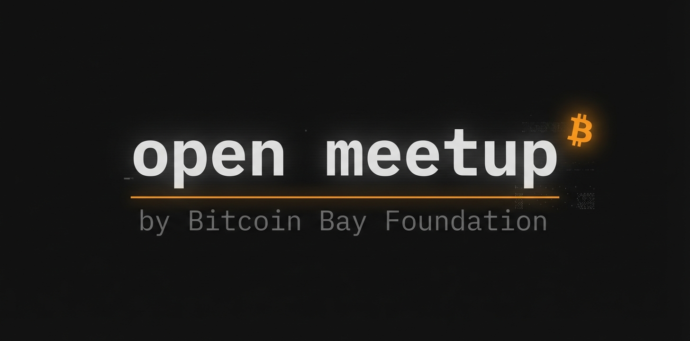

<p align="center">
  
</p>

# Open Meetup

**A free, open-source website template for Bitcoin meetup nonprofits.**

Built by [Bitcoin Bay Foundation](https://bitcoinbay.foundation) — a 501(c)(3) nonprofit in Tampa Bay, Florida.

```bash
npx @bitcoinbay/open-meetup my-meetup
```

## Why This Exists

Bitcoin meetups are the front lines of adoption. Every city needs one. But running a nonprofit is hard enough without also figuring out how to build a website, accept donations, manage events, send newsletters, and maintain all of it.

We built Bitcoin Bay's website from scratch — events, blog, donation checkout, newsletter, merchant map, photo galleries, admin panel — the full stack. Then we realized every Bitcoin meetup in the country needs the same thing. So we ripped out everything specific to us and made it a template anyone can use.

One command. Answer a few questions. Deploy to Vercel. You have a production website with:

- Event management with optional Meetup.com sync
- Blog CMS with markdown editor
- Bitcoin donations via Zaprite (on-chain, Lightning, card, bank transfer)
- Newsletter with Resend
- Bitcoin merchant map powered by BTC Map
- Photo gallery with drag-and-drop uploads
- Contact form with Telegram/Slack notifications
- Admin panel with 2FA
- Doctor page that tells you exactly what's configured and what's not
- Full docs at `/docs` explaining every integration

All of it is optional. Don't have Zaprite yet? The donate page still works — it just tells you how to set it up. No Meetup account? Events work fine from the admin panel. Every integration degrades gracefully. Start with nothing and add services as you grow.

## Why Bitcoin Bay

Bitcoin Bay Foundation was founded in January 2022 by [@bennyhodl](https://github.com/bennyhodl). What started as Tampa Bitdevs grew into the largest Bitcoin community in the Tampa Bay area — 5+ events per month, 100+ monthly attendees, a 501(c)(3) nonprofit, and a website that actually does what a Bitcoin nonprofit needs.

We believe in a few things:

**Sound money is a human right.** Bitcoin isn't a speculative asset to us. It's the foundation of economic freedom. Every person deserves access to money that can't be debased, seized, or censored.

**Community is the multiplier.** The best way to learn Bitcoin is from someone who already gets it. Meetups create that environment — in person, face to face, no gatekeeping. That's why we exist, and that's why we want every city to have what we have.

**AI makes us more capable, not less human.** We're an AI-forward nonprofit. We use AI agents to manage content, automate operations, and build tools like this one. The CLI that scaffolds your site, the admin panel that manages your content, the doctor that checks your setup — all of it was built with AI as a collaborator. We believe nonprofits should use every tool available to maximize their impact per dollar spent.

**Open source is how you scale impact.** We could have kept this as our competitive advantage. Instead, we're giving it away. Every Bitcoin meetup that uses Open Meetup strengthens the network. More meetups means more education, more adoption, more circular economies. The rising tide lifts all boats.

## For Meetup Organizers

You don't need to be a developer. You need:

- A Vercel account (free)
- 15 minutes to answer some questions
- API keys for the services you want (all optional, all documented)

The built-in docs at `/docs` walk you through every step. The doctor at `/admin/doctor` checks your setup and links to the exact guide for anything that's missing.

If you run a Bitcoin meetup and want help getting set up, [reach out to us](https://bitcoinbay.foundation/contact).

## License

MIT — use it however you want.

---

Built with conviction in Tampa Bay, Florida.

[bitcoinbay.foundation](https://bitcoinbay.foundation)
